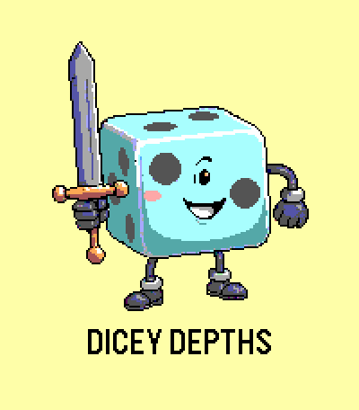
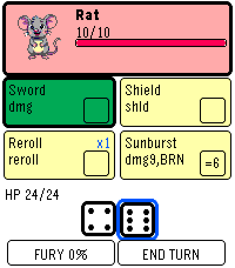
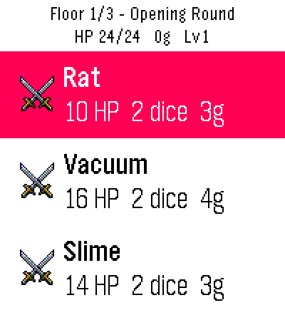
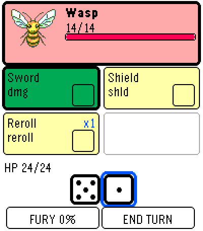
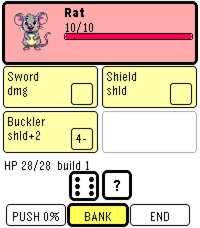
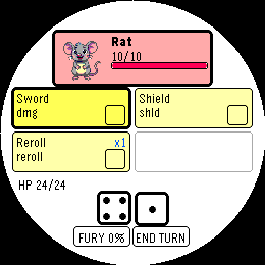

  
  
  

I take organisations from spreadsheets and disconnected systems to purpose-built Salesforce platforms. I work across the whole job: the architecture and the roadmap, the hands-on Apex, LWC and Flow, and the board-level conversation about what the platform can actually do.

Right now I'm the **Salesforce Administrator at The Royal Institution**. I'm also a founding team member and **Solutions Architect at Apex Infinity Solutions**, a Salesforce partner.

### 🛠️ Toolkit

**Clouds:** Sales · Service · Experience · Marketing · Digital Engagement

### 🏗️ Featured build: three systems, one org

A housing partner in Kent providing accommodation for 25+ local authorities across the South-East. Their whole operation ran across two legacy systems and a wall of spreadsheets. I led the build that moved all of it onto a single Salesforce org.

- 🔀 **Consolidation:** migrated everything into one org, with a clean council account hierarchy
- 📋 **Booking lifecycle:** a staged pipeline from available void to sign-out
- 🛡️ **Safeguarding flags:** dated duty-of-care banners on booking and property pages
- 🤖 **AI repairs triage:** tenants troubleshoot with an AI tool before a site visit is booked
- ✅ **Compliance on autopilot:** the next gas safety certificate is created as soon as the last one closes
- 🌐 **Council portal:** Experience Cloud self-service for bookings, certificates and standards
- 📊 **Void board:** a live vacancy and revenue dashboard, on screen in the office every day

➡️ [Read the full case study](https://nathanm95.github.io/#project)

---

### 🎲 Fun stuff: Pebble development, 2014 → 2026

Away from Salesforce I write watch apps and games in C for Pebble. I started in 2014 on the original watches and CloudPebble, and I'm still at it on the new Pebble Time 2 and Round 2.

**Dicey Depths** is my latest game: a dice roguelike inspired by Terry Cavanagh's *Dicey Dungeons*. You're a walking six-sided die on a game show. Every turn you roll your dice face up, *then* decide how to spend them across four equipment cards. A bad roll becomes a puzzle rather than a punishment. There are 3-floor runs, permadeath, a 5-ruleset campaign with a boss each, and an endless mode with a local top 10.

  
  
  
  
  
  

**Also on my wrist:**

| | |
|---|---|
| 🎯 **Pegble** | A Peggle-style pachinko game with levels and an endless mode |
| 🪐 **Orbital Face** | A watchface orrery. Shake your wrist and the planets fall loose under Kepler physics |
| 🙂 **Orbi Face** | An expressive robot face that blinks, winks and glances around |
| 🎡 **Roulette** | A European wheel watchface. Shake to spin |
| 🎾 **Pebble Tennis Tour** | A tennis RPG where you climb a five-tier tour ladder |

